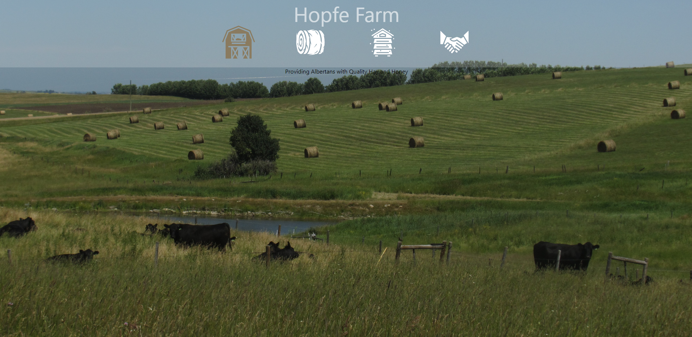

Farm website readme

---------------------------------------------------------------------------------
2020-02-30

Current State of Website: 
    -background image selected
    -header created with icons as functional links
    -functional tooltips
    -all four pages just have placeholder text currently
    -website is currently very responsive for desktop use -> unsure about mobile

Future Plans for Website:
    -Populate pages with appropriate displays and pictures.
    -Upload to server.
    -Create PostgreSQL database on server with necessary tables and data.
    -Create API for pulling table data from database and using it to populate website
    -Create Admin login with proper security/authentication
    -Add Admin UI for changing table Data.
    -Use API to update database data via the Admin UI.
    -Possibly find and add features depending on available APIs (current hay prices in region, 
        weather forecast, Google Maps, etc.)
